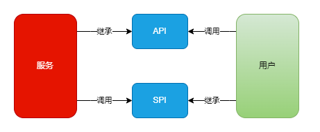

# core

- **IO复用**

  - **同步阻塞、同步非阻塞IO**都是**一个线程处理一个IO流**，故造成每个线程的使用时间都非常短，故线程会频繁切换，把资源浪费在上下文切换上

  - 故利用**一个**线程处理**多个**IO流，来实现降低资源浪费

    利用**一个**线程来监控所有IO流的数据**就绪状态**，若就绪，则**放出一个**线程去处理该IO流

- **selext、poll、epoll的区别**

  三者都是Linux API提供的IO复用方式

- **Socket和IO流的区别**

  - IO流一般指本地IO流

  - Socket是一种特殊的IO流，Socket是处于应用层和TCP/UDP之间的抽象层，我们可以使用Socket在**TCP/UDP协议**上对数据进行接收、获取和处理

- **Unicode编码**

  > 英语使用128个ASCII编码是足够的，但却**满足不了**其他国家字符的需求，于是Unicode编码诞生

  Unicode记录了世界上所有字符**对应的数字表示**

  https://www.cnblogs.com/crazylqy/p/10184291.html

- **SSL协议**

  是一种为网络通信**安全提供保障**的协议，**增强了**TCP协议，作用于应用层和运输层之间

- **API思想与SPI思想**

  SPI为服务端提供**接口**，用户端根据接口提供**实现**，把实现插入接口，实现用户根据**系统规则**添加**自定义功能**

- **TCP沾包、拆包**

  - 一个完整的消息包，可能为在TCP协议中，被拆分为多个小包，也可能多个消息包被合并为一个

  - **solved**
    - 在消息包的尾部，添加**特殊字符**，标识该包的范围，以使接收方可以知道整个包的具体轮廓
    - 发送的消息包都固定**同一长度**

- **CPU、IO密集型任务的线程数配置**

  - CPU密集型任务

    该任务为**计算**操作，故也称为计算密集型任务，而计算操作使用CPU，CPU一直处于**运行状态**，故线程个数可以设置为CPU核数，提高CPU利用率

    线程数可以少

  - IO密集型任务

    该任务为**IO**操作，该操作通过**线程**完成，而CPU处于**空闲状态**，故线程数可以设置为CPU核数的**多倍**，让其他线程可以操作CPU，提高CPU利用率
    
    线程数必须多

- **池化技术**

  - 把**可重复利用**的线程、连接，都统一管理起来，如JDK线程池、数据库连接池、Redis连接池
  - **JDK连接池不适用**于IO密集型任务，因为IO密集型任务的操作时间长，而JDK连接池会把过多的请求都暂时存储在请求队列上，造成多个IO请求没有立即执行，而整个任务的执行时间就会**延长**

- **灰度发布**

  - 部署产品的服务器有**多数**，产品新版本开发完成后，只在**一小部分**服务器安装产品新版本，让一部分用户提前体验新产品、对产品进行第一步**测试**
  - 若产品测试没问题，再把所有服务器都部署新版本；若产品有问题，则回滚版本进行升级
  - 避免所有的用户都体验到了bugs产品，也减少了回滚所有服务器版本的人力

- **通配符**

  - 上界通配符`<? extends Test>`

    表示该类型为Test或Test的子类

  - 下界通配符`<? super Test>`

    表示该类型为Test或Test的基类

- **时间戳**

  - 对某一时刻的特定**标识**
  - 如图片的名称后缀添加时间戳，代表图片的修改时间

- **幂等性**

  - 用户对某一操作无论**请求**多少次，其执行结果都与成功请求完**一次**的结果一致

  - **确保订单的幂等性**

    用户支付成功一次后，修改订单状态为已支付，若再请求则会返回已支付成功，其多次执行的结果都与成功请求完**一次**的结果一致

- **网站用户密码的加密方式**

  1. 对称加密算法

     类似于token的生成，需要**密钥**对密码进行加密后保存，加密后的密码可通过密钥进行**还原**

     需保护密钥的安全

  2. 非对称加密算法

     使用**公钥1**对密码进行加密，使用**私钥2**对密码进行解密

     公钥1可以公开，私钥2必须保护

  3. MD5等的**单向Hash**算法

     - 通过该Hash算法直接生成密文，该算法无法**反向破译**

     - 但可以有**碰撞**的几率来还原密码

       可以借助**彩虹表**进行还原，该表**应该是**存储了每个字符串，与其对应的经过Hash算法后生成的值

  4. 加盐Hash算法

     对单向Hash算法的增强，在原密码的基础上添加**固定盐**，后进行Hash算法

  5. PBKDF2算法

     对单向Hash算法的增强，在原密码的基础上添加**随机盐**，且对密码进行Hash算法处理，**至少**1000次

     原理为增大彩虹表的建表**难度**，使其无法破解**大量**的密码
  
- **乐观锁和悲观锁的实现方式**

  - 悲观锁

    使用synchronized、ReentrantLock等操作进行线程阻塞，阻止其他线程对本线程的干扰

  - 乐观锁

    使用CAS的**比较+替换**的方式实现，本线程在读取数据时不进行加锁，等到写数据的时候，**查询原值**是否为所读取的值，若是则直接替换新值；若不是则代表原值被**其他线程**修改了，需**重新读取**数据
  
- **浏览器请求服务器'下载文件'请求后，浏览器是如何下载文件的**

  猜测：浏览器请求，服务器响应请求成功，后服务器把相应的文件，以流的形式传输到浏览器
  
- **数据仓库和数据湖的区别**

  - 数据仓库存储**不同来源**的**结构化**数据

    数据格式统一，来源广泛

  - 数据湖存储**大规模**的**结构化、非结构化**数据

    数据格式杂，规模大
  
- **什么是协程**

  比线程更加轻量级的存在，一个线程可以拥有多个协程

  

# internet

- **HTTPS的加密**

  内容传输使用对称加密，**证书验证**使用非对称加密

  非对称加密效率低，不能使用在内容传输上

- **HTTPS连接过程**

  - 证书验证阶段：

    - 浏览器发送HTTPS请求

    - 服务端返回HTTPS**证书**

    - 客户端验证证书

      证书使用CA机构的**非对称加密技术**进行加密，若该证书附带的公钥能使用该技术进行解密成**明文**，则证书合法

  - 传输阶段：

    - 合法则生成**随机数**，使用证书上的**公钥**对随机数进行加密，传输到服务端

      该随机数**不是传输内容**，而是给服务端构造加密算法，本次连接传输的内容只有服务端发送的

      - 服务端通过证书的**私钥**解密随机数，再根据**随机数构造**对称加密算法，对返回内容进行加密，后传输

      - 客户端根据之前生成的随机数对返回内容进行解密

- **HTTPS为什么安全**

  - 证书验证

    服务端返回给客户端的证书，需要经过**CA机构认证**，才能算合法证书，若不合法证书则浏览器会告警

    则**避免了访问**非法服务端

  - 加密技术

    即使中间人拦截了客户端发送的随机数，需要获取服务端的私钥才能解密

    即使中加入拦截了服务端发送的返回内容，需要获取客户端的随机数才能解密

- **ip层发送请求的过程**

  - TCP层每发送一份**报文**，需要添加源地址、目标地址到ip**请求头**
  - ip层会判断目标地址是否在**局域网**
  - 若在局域网，则通过**ARP协议**获取**目标地址**的MAC地址，再把源MAC地址、目标MAC地址添加到MAC头，发送出去
  - 若不在局域网，则通过ARP协议获取**网关**的MAC地址，再把源MAC地址、网关MAC地址添加到MAC头，发送出去

- **TCP Out Of Order的原因**

  > TCP报文的乱序

  - 网络拥塞，造成包**抵达**的时间不同
  - 包**丢失**
  
- **HTTP请求建立的过程**

  - 域名解析

    将域名解析为**ip地址**

  - 客户端与服务器建立**TCP**连接

  - 客户端开始发起HTTP请求
  
- **TCP长连-数据协议**

  Protobuf协议为**高度压缩**的通信协议，该协议的Protocol buff的传输效率相比JSON快了6倍

# operation system

- **LRU和LFU的区别**
  - LRU为最近**最少使用**页面置换算法
  - LFU为最近**最不常用**页面置换算法
  
- **CPU的内部组成**

  1. 控制单元

    程序计数器

  2. 存储单元

    CPU片内缓存

  3. 运算单元

    算术运算逻辑单元：实现+-*

# encryption

**MD5**

> 非对称加密算法

- 信息摘要**加密算法**，可以将密码字符串加密为128位（16字节）的散列值
- 该加密算法存在可**碰撞**的缺陷，即有机率发生碰撞将散列值解析为**明文**
- 该加密算法不能**反向解密**，可以解析为明文的情况是由于出现碰撞

**RAS**

- 非对称加密算法

# attack

**跨站脚本攻击**

> XXS，利用用户对网站的信任

- **what**

  论坛网站用户可以**评论**，用户可以编辑一段HTML代码发布后该评论是一个**链接**，功能是获取其他用户本地的cookie，若用户点击该评论则会泄露cookie

- **防范**

  把用户可以输入内容的标签，进行**特殊转化**，用户发布评论后这些标签不会是原有的标签格式，而是转换为特殊的格式，防止了链接的生成

**跨站请求伪造**

> CSRF，利用网站对用户浏览器的信任

- **what**

  浏览器经过网站认证授权后，在一段时间内浏览器可以不重新认证而访问该网站，若用户把进行**敏感操作**的恶意url通过**评论**的方式发布，其他用户点击该评论后，因本浏览器已经过认证，该敏感操作无需验证，网站为认为是用户**本身自愿**进行操作

- **防范**

  - 设置不保存在**cookie**中的校验数据，服务器生成随机数返回给用户浏览器进行保存，若进行敏感操作进行携带该随机数进行验证
  - 添加**验证码**步骤，确保是用户本人操作

**计时攻击**

- 根据服务器的运算时间，**推测**所使用的**运算操作**

  这些信息可用于对系统做**进一步**破解

**DDOS攻击**

> Distribution Denial of service分布式拒绝服务攻击

- 建立在三次握手基础上，客户端向服务端发送SYN联机**请求后断线**，服务端发送的SYN+ACK报文在没有客户端应答就会在一段时间内**继续重试**
- 攻击者制造了无数这种请求，导致服务端无数次发送报文、重试，服务端资源被**耗光**，不能给正常用户提供服务

# how to achieve

- **如何从存储大量的url的a、b两个文件中，获取相同的url**

  > 思想是**分治策略**，**减少不必要的**遍历与比较
  >
  > - hash淘汰不必要的
  > - HashSet淘汰不必要的

  - 对a文件的每个url进行`hash(url) % 1000操作`，采用**分治策略**，则a文件的url会存储到多1000个文件中，对b文件进行相同操作

    每个String类型的相同url进行hash操作，返回的是相同值

  - 把a、b文件的各1000个文件中的url分别存储在1000个**HashSet**中

    则每次从a、b中，取出第n个文件的HashSet，对比获取相同的url

- **如何从存储大量单词的文件中，获取高频词**

  > 思想是**分治策略**，**减少不必要的**遍历与比较
  >
  > - 大部分分成小部分，减少小部分的**非高频词的遍历**

  - 对该文件的每个单词执行hash(word) % 1000，则所有单词会存储到1000个文件中，统计出1000个文件中每个文件的**前100**个高频词，再统计出这多个前100的高频词中，哪个是最高频的

- **如何实现限流**

  > 时间上的限制、请求次数上的限制
  - **计数器**

    > 一定时间段设置总数

    设置在1min中，每个程序可以请求的次数n，进行**计数**，若超过限制次数则代表应该限流

    劣势：若在1min中的最后1s，一次性请求n次，则不会进行限制，但造成当前时间点服务器压力过大

  - **滑动窗口**

    > 把一定时间段进行细分，每n个小时间段设置总数

    把1min进行6**等份细分**，即设置10s内可以请求的次数，采用**计数器**对**每**10s进行请求计数，每10s的请求总数到达n/6，则代表应该限流

    好处：防止了在极短时间内进行**大量请求**的情况，每个10s的推进类似于窗口的滑动

      劣势：支出了多个计数器的线程**消耗**

- **短链如何设计**

  需要一台短链生成服务器，该服务器保存了短链和长链的**对应关系**，用户请求短链，首先会经过短链服务器，服务器再把链接重定向到长链
  
- **服务集群如何实现session共享，在负载均衡的条件下如何实现session共享**

  > 若无法实现共享，会出现用户在服务器a登录后，**再**请求服务器b时，服务器b没有保存用户登录后产生的session，造成用户需要**重新登录一次**

  1. **会话保持**

     **负载均衡**时，实现**同一个**客户端只会访问**同一个**服务器，故杜绝了以上情况

     problems：该操作会使负载均衡失效

  2. 会话共享

     服务集群都在**同一个节点**，进行session的存取

  3. 会话复制

     把服务器a生成的session，复制到其他服务器

​	
