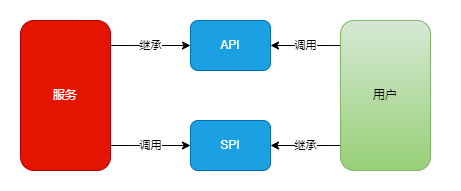

# core

- **IO复用**

  - 同步阻塞、同步非阻塞IO都是**一个线程处理一个IO流**，故造成每个线程的使用时间都非常短，故线程会频繁切换，把资源浪费在上下文切换上

  - 故利用**一个**线程处理**多个**IO流，来实现降低资源浪费

    利用一个线程来监控所有IO流的数据**就绪状态**，若就绪，则**放出**一个线程去处理该IO流
  
- **Unicode编码**

  > 英语使用128个ASCII编码是足够的，但却**满足不了**其他国家字符的需求，于是Unicode编码诞生

  Unicode记录了世界上所有字符**对应的数字表示**

  https://www.cnblogs.com/crazylqy/p/10184291.html
  
- **SSL协议**

  是一种为网络通信**安全提供保障**的协议，**增强了**TCP协议，作用于应用层和运输层之间
  
- **API思想与SPI思想**

  SPI为服务端提供**接口**，用户端根据接口提供**实现**，把实现插入接口，实现用户根据**系统规则**添加**自定义功能**

- **TCP沾包、拆包**

  - 一个完整的消息包，可能为在TCP协议中，被拆分为多个小包，也可能多个消息包被合并为一个

  - **solved**

    - 在消息包的尾部，添加**特殊字符**，标识该包的范围，以使接收方可以知道整个包的具体轮廓
    - 发送的消息包都固定**同一长度**

    

# 攻击技术

**跨站脚本攻击**

> XXS，利用用户对网站的信任

- **what**

  论坛网站用户可以**评论**，用户可以编辑一段HTML代码发布后该评论是一个**链接**，功能是获取其他用户本地的cookie，若用户点击该评论则会泄露cookie

- **防范**

  把用户可以输入内容的标签，进行**特殊转化**，用户发布评论后这些标签不会是原有的标签格式，而是转换为特殊的格式，防止了链接的生成

**跨站请求伪造**

> CSRF，利用网站对用户浏览器的信任

- **what**

  浏览器经过网站认证授权后，在一段时间内浏览器可以不重新认证而访问该网站，若用户把进行**敏感操作**的恶意url通过**评论**的方式发布，其他用户点击该评论后，因本浏览器已经过认证，该敏感操作无需验证，网站为认为是用户**本身自愿**进行操作

- **防范**

  - 设置不保存在**cookie**中的校验数据，服务器生成随机数返回给用户浏览器进行保存，若进行敏感操作进行携带该随机数进行验证
  - 添加**验证码**步骤，确保是用户本人操作

**计时攻击**

- 根据服务器的运算时间，**推测**所使用的**运算操作**

  这些信息可用于对系统做进一步破解

**DDOS攻击**

> Distribution Denial of service分布式拒绝服务攻击

- 建立在三次握手基础上，客户端向服务端发送SYN联机**请求后断线**，服务端发送的SYN+ACK报文在没有客户端应答就会在一段时间内**继续重试**

  攻击者制造了无数这种请求，导致服务端无数次发送报文、重试，服务端资源被耗光，不能给正常用户提供服务

# problem

- **如何从存储大量的url的a、b两个文件中，获取相同的url**

  > 思想是**分治策略**，**减少不必要的**遍历与比较
  >
  > - hash淘汰不必要的
  > - HashSet淘汰不必要的

  - 对a文件的每个url进行`hash(url) % 1000操作`，采用**分治策略**，则a文件的url会存储到多1000个文件中，对b文件进行相同操作

    每个String类型的相同url进行hash操作，返回的是相同值

  - 把a、b文件的各1000个文件中的url分别存储在1000个**HashSet**中

    则每次从a、b中，取出第n个文件的HashSet，对比获取相同的url

- **如何从存储大量单词的文件中，获取高频词**

  > 思想是**分治策略**，**减少不必要的**遍历与比较
  >
  > - 大部分分成小部分，减少小部分的**非高频词的遍历**

  - 对该文件的每个单词执行hash(word) % 1000，则所有单词会存储到1000个文件中，统计出1000个文件中每个文件的**前100**个高频词，再统计出这多个前100的高频词中，哪个是最高频的

- **如何实现限流**

  > 时间上的限制、请求次数上的限制
  - **计数器**
  
    > 一定时间段设置总数
  
    设置在1min中，每个程序可以请求的次数n，进行**计数**，若超过限制次数则代表应该限流
  
    劣势：若在1min中的最后1s，一次性请求n次，则不会进行限制，但造成当前时间点服务器压力过大
  
  - **滑动窗口**
  
    > 把一定时间段进行细分，每n个小时间段设置总数
  
    把1min进行6**等份细分**，即设置10s内可以请求的次数，采用**计数器**对**每**10s进行请求计数，每10s的请求总数到达n/6，则代表应该限流
  
    好处：防止了在极短时间内进行**大量请求**的情况，每个10s的推进类似于窗口的滑动
  
      劣势：支出了多个计数器的线程**消耗**